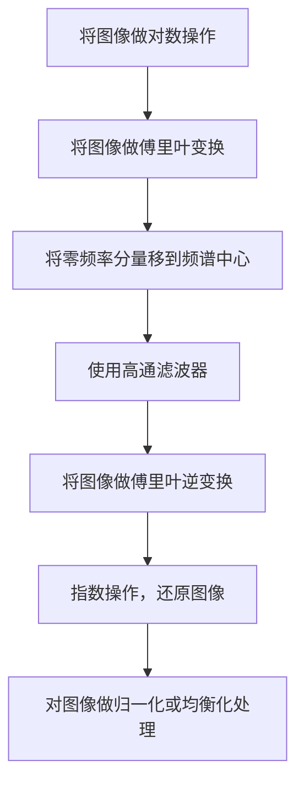

#### 实验一 同态滤波实验

##### 1 实验简介和目的

同态滤波是一种广泛用于信号和图像处理的技术，将原本的信号经由非线性映射，转换到可以使用线性滤波器的不同域，做完运算后再映射回原始域。同态的性质就是保持相关的属性不变，而同态滤波的好处是将原本复杂的运算转为效能相同但相对简单的运算.

同态滤波利用去除乘性噪声(multiplicative noise)，可以同时增加对比度以及标准化亮度，借此达到图像增强的目的。

##### 2 算法模型和原理

一副图像可以表示为其亮度(illumination)分量和反射(reflectance)分量的乘积，虽然在时域上这两者是不可分离的，但是经由傅立叶转换两者在频域中可以线性分离。由于照度可视为环境中的照明，相对变化很小，可以看作是图像的低频成分；而反射率相对变化较大，则可视为高频成分。通过分别处理照度和反射率对像元灰度值的影响，通常是借由高通滤波器(high-pass filter)，让图像的照明更加均匀，达到增强阴影区细节特征的目的。

对于一副图像，可表示为照射分量和反射分量的乘积，即

$m(x,y)=i(x,y)\cdot r(x,y)$

其中，m为图像，i为照度分量，r为反射分量。

为了在频域中使用高通滤波器，我们必须进行傅立叶转换，但由于上式是一个乘积式，不能直接对照度和反射的频率分量进行操作，因此对上式取对数

$ln\{m(x,y)\}=ln\{i(x,y)\}+ln\{r(x,y)\}$

然后再对上式两边做傅立叶转换，

$ \mathcal{F}\{\ln\{f(x,y)\}=\mathcal{F}\{\ln\{i(x,y)\}+\mathcal{F}\{\ln\{r(x,y)\}$

令$\mathcal{F}\{\ln\{f(x,y)\}=M(u,v)$

则$N(u,v)=H(u,v)\cdot M(u,v)$

其中，N是频域中滤波后的图像，H是高通滤波器。

为了将图像从频域转回时域，对N做傅立叶逆转换

$n(x,y)=\mathcal{F}^{-1}\{\ln\{f(x,y)\}$

最后，对n使用指数函数(exponential)来复一开始取的自然对数

$m'(x,y)=e^{\{n(x,y)\}}$

m'为同态滤波后的新图像

##### 3 算法框图



为了获得最好的处理效果，我在最后添加了对处理过的图像做归一化和均衡化处理.这是因为在使用高通滤波器后图像的能量有所损失，得到的图像会偏暗。

##### 3 程序设计

本程序使用python的numpy和opencv实现

函数解释：

`def HighPassGaussianFilter(sigma)`：2D高斯高通滤波器，sigma为高斯函数的$\sigma$

`np.fft.fft2(img)`numpy的傅里叶变换函数

`np.fft.fftshift(f)`numpy移动频谱图

`np.fft.ifft2(f_ishift)`numpy傅里叶逆变换

程序源代码

```python
import cv2 as cv
import numpy as np
name = 'image002.png'
img = cv.imread(name, 0)
rows, cols = img.shape
crow, ccol = rows // 2 , cols // 2

size = min(rows, cols)
percentage = 1
size *= percentage
size = int(size)
if size % 2 == 0 :
    size -= 1

def HighPassGaussianFilter(sigma) :

    x = cv.getGaussianKernel(size, sigma)
    gaussian = x*x.T
    edgeval = gaussian[0][0]
    centerval = gaussian[size//2][size//2]
    gaussianrange =  centerval - edgeval
    gaussian = (gaussian - edgeval) / (gaussianrange)
    gaussian = 1 - gaussian
    return gaussian

img1 = img.copy()
img1 = img.astype('float64')
imgbefore = img
imgbefore = img.astype('float64')
sig = 40
gaussianfilter = HighPassGaussianFilter(sig)
# optimal value :
# image002:  1
# image006:  1.15
# cafe3:  4.5
# bookstore: 4.56

for i in range(1) :
    minval = np.min(img1[:,:])
    maxval = np.max(img1[:,:])
  
    img1[:,:] = 1 + (img1[:,:] - minval)/(maxval - minval) * 254
    imgbefore[:,:] = img1[:,:]

    img1[:,:] = np.log(img1[:,:])
    f = np.fft.fft2(img1[:,:])
    fshift = np.fft.fftshift(f)
    fshift[crow-size//2:crow+size//2+1,ccol-size//2:ccol+size//2+1] *= gaussianfilter
    f_ishift = np.fft.ifftshift(fshift)
    img_back = np.fft.ifft2(f_ishift)
    img_back = np.real(img_back)

    img1[:,:] = np.exp(img_back)
    
    minval = np.min(img1[:,:])
    maxval = np.max(img1[:,:])
    img1[:,:] = (img1[:,:] - minval)/(maxval - minval) * 255


img1 = img1.astype('uint8') 

equalized = cv.equalizeHist(img1)
# equalized = 16 * np.sqrt(img1)

imgbefore = imgbefore.astype('uint8')

cv.imwrite(name[:-4] + ' sigma=' + str(sig) + ' filtered.jpg',img1)
cv.imwrite(name[:-4] + ' sigma=' + str(sig) + ' filtered&equalized.jpg',equalized)

```

##### 4 实验分析

实验采取了课程pdf上的两张图片和生活中的一些图片，在高斯高通滤波器不同的$\sigma$下的输出

其中，$\sigma$越大，过滤效果越强


